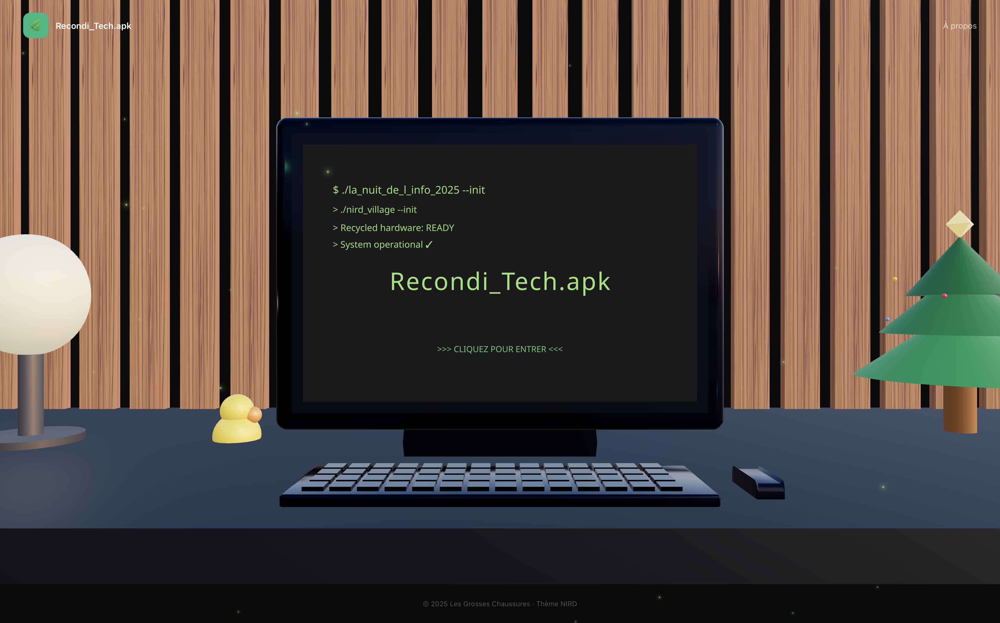
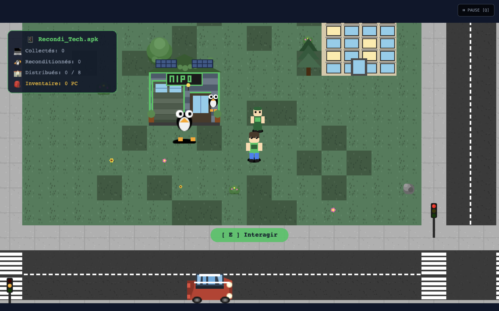
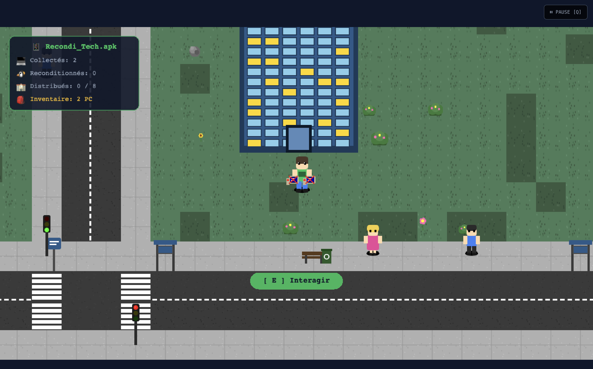
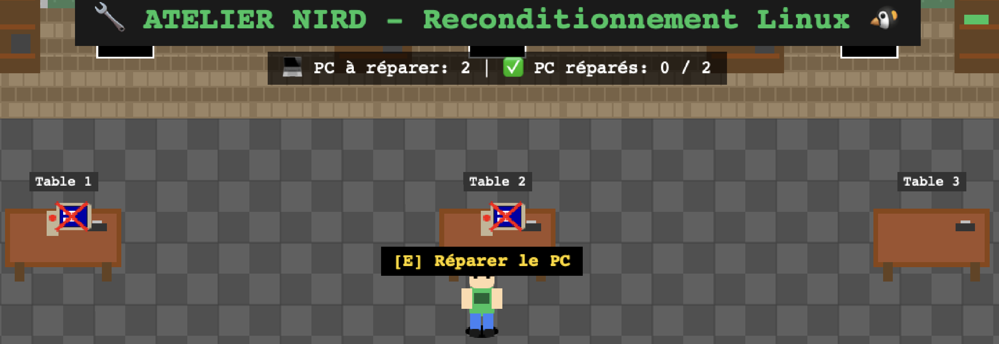
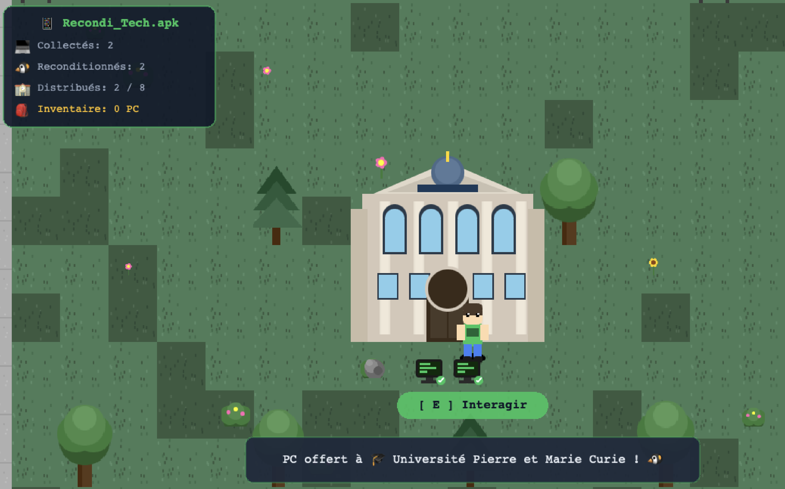

# 🔄 Recondi_Tech

> **Mini-jeu éducatif sur le réemploi numérique** - Projet réalisé lors de **La Nuit de l'Info 2025** par l'équipe **Les Grosses Chaussures**

[](./images/landing_page.png)

## 🎯 Mission pédagogique

**Recondi_Tech** sensibilise au **NIRD** (Numérique Inclusif, Responsable, Durable et de Réemploi) à travers une aventure interactive où le joueur apprend à :

- ♻️ **Récupérer** des ordinateurs obsolètes dans les entreprises
- 🐧 **Reconditionner** ces machines sous Linux pour leur donner une seconde vie
- 🏫 **Redistribuer** les équipements aux établissements scolaires
- 🤖 **Discuter** avec un technicien IA pour en apprendre plus sur l'open-source

## 🎮 Concept du jeu

Un jeu d'aventure isométrique où vous incarnez un **agent NIRD** dans un village numérique virtuel :

1. **Collecte** : Récupérez des PC Windows obsolètes auprès des entreprises
2. **Reconditionnement** : Apportez-les à l'atelier NIRD pour les transformer sous Linux
3. **Distribution** : Distribuez les ordinateurs reconditionnés aux écoles
4. **Apprentissage** : Discutez avec le technicien IA pour découvrir l'univers Linux

[](./images/arrive_in_game.png)

## 🎬 Démonstration vidéo

Découvrez le gameplay complet en action :

[](./video/discusion_ia.mp4)

*Vidéo de démonstration : Discussion avec le technicien IA et découverte de l'atelier NIRD*

## 📸 Captures d'écran

### 🏢 Collecte des PC obsolètes
[](./images/recuperation_pc_entreprise.png)
*Récupération d'ordinateurs obsolètes dans les entreprises locales*

### 🔧 Atelier de reconditionnement
[](./images/reconditionnement_pc.png)
*Mini-jeu de reconditionnement : installation de Linux et configuration système*

### 🏫 Distribution aux écoles
[](./images/pc_offert_ecole.png)
*Distribution des ordinateurs reconditionnés aux établissements scolaires*

## ✨ Fonctionnalités

### 🎯 Gameplay complet
- **Exploration** : Village isométrique avec bâtiments interactifs
- **Collecte** : Système d'inventaire limité (2 PC maximum)
- **Mini-jeu** : Atelier de reconditionnement avec interface desktop
- **Distribution** : Système de livraison aux écoles (2 PC par établissement)
- **Objectif** : Distribuer 8 PC pour gagner la partie

### 🤖 Intelligence artificielle
- **Chatbot IA** : Technicien NIRD alimenté par Mistral AI
- **Connaissances** : Base de données sur Linux, open-source et NIRD
- **Interactions** : Dialogues contextuels avec les PNJ

### 🎨 Interface utilisateur
- **HUD moderne** : Statistiques en temps réel (PC collectés/reconditionnés/distribués)
- **Messages** : Système de notifications pour les interactions
- **Responsive** : Design adaptatif pour tous les écrans

### 🎪 Animations et effets
- **Ordinateur 3D** : Page d'accueil avec modèle Three.js animé
- **Transitions** : Effets de fondu et animations fluides
- **Feedback visuel** : Indicateurs d'interaction et animations de succès

## 🛠️ Stack technique

| Technologie | Usage | Version |
|-------------|-------|---------|
| **React** | Framework UI | 19.2.0 |
| **TypeScript** | Typage statique | 5.9.3 |
| **Vite** | Build tool | 7.2.4 |
| **Phaser 3** | Moteur de jeu 2D | 3.90.0 |
| **Three.js** | Graphismes 3D | 0.181.2 |
| **TailwindCSS** | Framework CSS | 4.1.17 |
| **Mistral AI** | Intelligence artificielle | API |
| **Zustand** | State management | 5.0.9 |

## 📁 Architecture du projet

```
src/
├── components/
│   ├── Computer3D.tsx      # Ordinateur 3D animé (Three.js)
│   └── ChatBot.tsx         # Interface de chat IA
├── game/
│   ├── Game.tsx            # Wrapper React pour Phaser
│   ├── MainScene.ts        # Scène principale du jeu
│   ├── phaserConfig.ts     # Configuration Phaser
│   └── scenes/
│       ├── BootScene.ts    # Chargement des assets
│       ├── MainScene.ts    # Jeu principal
│       ├── UIScene.ts      # Interface utilisateur
│       └── WorkshopScene.ts # Atelier de reconditionnement
├── pages/
│   ├── Home.tsx            # Page d'accueil 3D
│   ├── GamePage.tsx        # Page du jeu
│   └── About.tsx           # Démarche NIRD
├── store/
│   └── gameState.ts        # État global (Zustand)
├── assets/                 # Sprites, textures, sons
├── knowledge/              # Base de connaissances IA
└── utils/                  # Utilitaires et helpers
```

## 🚀 Installation & Lancement

### Prérequis
- **Node.js** 20+ (utiliser `nvm use 20` si nécessaire)
- **npm** ou **yarn**

### Démarrage rapide

```bash
# Cloner le dépôt
git clone https://github.com/iamhmh/nuitdelinfo_lesgrosseschaussures.git
cd nuitdelinfo_lesgrosseschaussures

# Installer les dépendances
npm install

# Configuration de l'IA (optionnel)
cp .env.example .env
# Éditer .env avec votre clé Mistral AI

# Lancer le serveur de développement
npm run dev
```

Le jeu sera accessible sur **http://localhost:5173**

### Scripts disponibles

```bash
npm run dev      # Serveur de développement avec hot-reload
npm run build    # Build de production optimisé
npm run preview  # Prévisualisation du build
npm run lint     # Vérification du code (ESLint)
```

## 🎯 Comment jouer

### 🕹️ Contrôles
- **Z/Q/S/D** ou **Flèches** : Déplacement du personnage
- **E** : Interaction avec objets/bâtiments/PNJ
- **Q** : Menu pause
- **Clic souris** : Navigation dans l'atelier

### 🏆 Objectif
1. **Collectez** 2 PC maximum dans votre inventaire
2. **Rendez-vous** à l'atelier NIRD (bâtiment avec antenne)
3. **Reconditionnez** les PC sous Linux dans le mini-jeu
4. **Distribuez** les ordinateurs aux écoles (2 par établissement)
5. **Répétez** jusqu'à avoir distribué 8 PC au total
6. **Victoire** ! Écran de fin avec statistiques

### 💡 Conseils
- Parlez au **technicien IA** près de l'atelier pour des conseils
- Les écoles acceptent maximum **2 PC** chacune
- L'inventaire est limité à **2 PC** non reconditionnés
- Utilisez le **menu pause (Q)** pour voir les contrôles

## 👥 Équipe Les Grosses Chaussures

**4 développeurs passionnés** pour **14h de code intensif** lors de La Nuit de l'Info 2025 :

- **Développeurs** : Équipe complète full-stack
- **Designer** : Interface utilisateur et expérience
- **Game Designer** : Mécaniques de jeu et équilibrage
- **IA Specialist** : Intégration Mistral AI et chatbot

## 📜 Licence & Crédits

**Projet open-source** réalisé dans le cadre de **La Nuit de l'Info 2025**.

### Technologies utilisées
- **Phaser 3** - Moteur de jeu open-source
- **Three.js** - Bibliothèque 3D open-source
- **Mistral AI** - IA française pour le chatbot
- **Linux** - Système d'exploitation reconditionné

### Ressources
- Sprites et assets créés pour l'événement
- Base de connaissances IA sur l'open-source
- Documentation pédagogique sur le NIRD

---

*Fait avec 💚 pour un numérique plus responsable et inclusif*

[](./images/landing_page.png)
